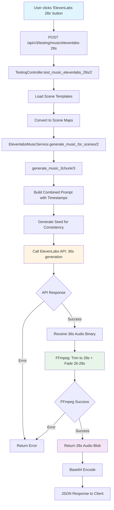

# ElevenLabs 28-Second Music Generation - Complete Integration Guide

## Overview

This document describes the complete process for generating a 28-second music track using ElevenLabs Music API that is:
- **4-second scene-synced**: Beat markers align perfectly with scene changes every 4 seconds
- **Fade-controlled**: Fades out only in the last 2 seconds (26-28s)
- **Single cohesive track**: Generated in one API call with all 7 scenes in a single prompt

## Architecture Flow



## Dependencies & Tools

### Required Software
1. **FFmpeg** - Must be installed and available in system PATH
   - Used for: Audio trimming and fade application
   - Version: Any recent version (tested with FFmpeg 6.x)

### Required Libraries (Elixir/Phoenix)
1. **Req** - HTTP client for API calls
   - Hex package: `req`
   - Used for: Making HTTP requests to ElevenLabs API

2. **Jason** - JSON encoding/decoding
   - Hex package: `jason`
   - Used for: Parsing API responses

### External APIs
1. **ElevenLabs Music API**
   - Endpoint: `https://api.elevenlabs.io/v1/music/compose`
   - Authentication: API key via `xi-api-key` header
   - Rate Limits: Check ElevenLabs documentation
   - Timeout: 120 seconds (for 36s generation)

## Configuration

### Environment Variables

Set the following environment variable before starting the application:

```bash
# Required
export ELEVENLABS_API_KEY="your-api-key-here"
```

### Application Configuration

In `config/dev.exs` or `config/runtime.exs`:

```elixir
config :backend,
  elevenlabs_api_key: System.get_env("ELEVENLABS_API_KEY")
```

### API Endpoint Configuration

The service uses the following ElevenLabs endpoint:
- **URL**: `https://api.elevenlabs.io/v1/music/compose`
- **Method**: POST
- **Content-Type**: `application/json`
- **Response**: Binary audio (MP3)

## Step-by-Step Process

### Step 1: Request Initiation

**Endpoint**: `POST /api/v3/testing/music/elevenlabs-28s`

**Request Body**:
```json
{
  "scene_types": ["hook", "bedroom", "vanity", "tub", "living_room", "dining", "outro"],
  "default_duration": 4.0
}
```

**Controller**: `BackendWeb.Api.V3.TestingController.test_music_elevenlabs_28s/2`

### Step 2: Scene Template Loading

The controller loads scene templates and converts them to scene maps:

```elixir
scenes = [
  %{
    "title" => "The Hook",
    "description" => "Opening cinematic impact...",
    "duration" => 4.0,
    "music_description" => "Opening cinematic impact with subtle water ambience",
    "music_style" => "cinematic, piano-focused, smooth",
    "music_energy" => "medium-high"
  },
  # ... 6 more scenes
]
```

### Step 3: Service Call

**Function**: `ElevenlabsMusicService.generate_music_for_scenes(scenes, options)`

**Options**:
```elixir
%{
  default_duration: 4.0,
  fade_duration: 1.5  # Not used in this flow, but included for compatibility
}
```

### Step 4: Prompt Construction

**Function**: `build_28s_prompt_with_timestamps(scenes)`

**Process**:
1. Iterate through all 7 scenes
2. For each scene, create timestamped entry: `"0-4s: Scene Title - Description"`
3. Combine all scene descriptions
4. Add base style and BPM instructions

**Example Prompt Structure**:
```
luxury vacation getaway, cinematic, piano-focused, smooth, medium-high energy. 
36-second instrumental track with clear scene transitions every 4 seconds. 
0-4s: The Hook - Opening cinematic impact with subtle water ambience. 
4-8s: The Hero Bedroom - Smooth transition with luxurious, serene tones. 
8-12s: Bathroom Vanity - Clean, crisp tones maintaining elegant flow. 
12-16s: The Feature Tub - Intimate, spa-like atmosphere with gentle progression. 
16-20s: Living Room - Expansive, flowing movement showcasing space. 
20-24s: Lifestyle / Dining Area - Warm, inviting atmosphere with subtle movement. 
24-28s: The Outro - Cinematic conclusion with peaceful resolution. 
120 BPM (2 beats per second, 8 beats per 4-second scene change) with strong beat markers at 0s, 4s, 8s, 12s, 16s, 20s, 24s, 28s. 
CRITICAL: Maintain FULL energy and volume throughout the entire track. 
NO fade in. NO fade out. NO volume reduction. 
Keep constant, steady energy from start to finish. 
Smooth, flowing transitions between scenes. 
Instrumental, piano-focused.
```

**Key Prompt Elements**:
- **Duration**: 36 seconds (generated), will be trimmed to 28s
- **BPM**: 120 BPM = 2 beats/second = 8 beats per 4-second scene change
- **Beat Markers**: Explicitly specified at 0s, 4s, 8s, 12s, 16s, 20s, 24s, 28s
- **No Fade Instructions**: Explicitly tells ElevenLabs NOT to fade (we handle it with FFmpeg)

### Step 5: Seed Generation

**Function**: Seed is generated from scene hash for consistency

```elixir
seed = :erlang.phash2(scenes) |> rem(4294967295)
```

**Purpose**: Ensures reproducible results when generating the same scenes

### Step 6: ElevenLabs API Call

**Function**: `call_elevenlabs_api_simple(full_scene, generate_options, api_key)`

**Request Body**:
```json
{
  "prompt": "<combined prompt with all scenes and timestamps>",
  "music_length_ms": 36000,
  "output_format": "mp3_44100_128",
  "force_instrumental": true,
  "seed": 51758988
}
```

**Request Headers**:
```
xi-api-key: <your-api-key>
Content-Type: application/json
```

**Response**: Binary MP3 audio data (36 seconds)

**Timeout**: 120 seconds (important for long generation)

### Step 7: FFmpeg Processing

**Function**: `trim_and_fade_to_28s(audio_blob, 26.0, 2.0)`

**Process**:
1. Write 36s audio blob to temporary file
2. Apply FFmpeg filter to:
   - Trim to exactly 28 seconds
   - Apply fade out starting at 26s, duration 2s (ends at 28s)
3. Read processed audio
4. Clean up temporary files

**FFmpeg Command**:
```bash
ffmpeg -i input.mp3 \
  -filter_complex "[0:a]atrim=0:28,asetpts=PTS-STARTPTS,afade=t=out:st=26:d=2[out]" \
  -map "[out]" \
  -t 28 \
  -q:a 2 \
  output.mp3
```

**Filter Breakdown**:
- `atrim=0:28`: Trim audio to 28 seconds
- `asetpts=PTS-STARTPTS`: Reset timestamps after trim
- `afade=t=out:st=26:d=2`: Fade out starting at 26s, duration 2s
- `-t 28`: Ensure output is exactly 28 seconds
- `-q:a 2`: High quality audio encoding

### Step 8: Response Formatting

**Response Structure**:
```json
{
  "success": true,
  "provider": "elevenlabs",
  "method": "28s-composition-plan",
  "scene_count": 7,
  "audio_size_bytes": 1234567,
  "total_duration_seconds": 28.0,
  "audio_base64": "<base64-encoded-audio>",
  "description": "Single cohesive 28-second track with seamless segues between sections (12s + 12s + 4s)",
  "scenes": [
    {
      "title": "The Hook",
      "duration": 4.0,
      "music_style": "cinematic, piano-focused, smooth",
      "music_energy": "medium-high"
    },
    // ... 6 more scenes
  ]
}
```

## Key Implementation Details

### Why 36 Seconds?

- **Buffer**: Generates 36s to ensure we have enough audio even if ElevenLabs generates slightly less
- **Fade Prevention**: Extra buffer helps avoid any fade artifacts that might occur near the end
- **Trim Safety**: Gives us flexibility to trim to exactly 28s without worrying about edge cases

### Why 120 BPM?

- **Mathematical Alignment**: 120 BPM = 2 beats per second = 8 beats per 4 seconds
- **Perfect Sync**: Creates natural beat markers that align with 4-second scene changes
- **Industry Standard**: 120 BPM is a common tempo for cinematic music

### Why Fade at 26-28s?

- **User Requirement**: Fade should only occur in the last 2 seconds
- **Full Energy**: Maintains full energy for 26 seconds (6.5 scene changes)
- **Smooth Ending**: 2-second fade provides smooth conclusion without abrupt cutoff

### Why Single Prompt Instead of Composition Plan?

- **Simplicity**: Single API call instead of complex composition plan structure
- **Reliability**: Avoids composition plan API limitations and errors
- **Control**: Full control over prompt structure and timing
- **Consistency**: Single generation ensures cohesive musical flow

## Error Handling

### API Errors

**Common Error Responses**:
- `422 Unprocessable Entity`: Invalid request format
- `401 Unauthorized`: Invalid or missing API key
- `429 Too Many Requests`: Rate limit exceeded
- `500 Internal Server Error`: ElevenLabs service error

**Error Handling**:
```elixir
case Req.post(...) do
  {:ok, %{status: 200, body: audio_blob}} -> # Success
  {:ok, %{status: status, body: body}} -> # API error
  {:error, exception} -> # Network/timeout error
end
```

### FFmpeg Errors

**Common Issues**:
- FFmpeg not installed or not in PATH
- Insufficient disk space for temporary files
- Invalid audio format

**Error Handling**:
```elixir
case System.cmd("ffmpeg", args, stderr_to_stdout: true) do
  {_output, 0} -> # Success
  {output, exit_code} -> # FFmpeg error
end
```

### Timeout Handling

**Timeout Configuration**:
- API Request: 120 seconds (`receive_timeout: 120_000`)
- Reason: 36-second music generation can take 60-90 seconds

## Integration Checklist

For integrating this into another repository:

- [ ] Install FFmpeg and ensure it's in system PATH
- [ ] Add `req` and `jason` dependencies to `mix.exs`
- [ ] Set `ELEVENLABS_API_KEY` environment variable
- [ ] Configure application config with API key
- [ ] Implement `ElevenlabsMusicService` module
- [ ] Implement `build_28s_prompt_with_timestamps/1` function
- [ ] Implement `call_elevenlabs_api_simple/3` function
- [ ] Implement `trim_and_fade_to_28s/3` function
- [ ] Implement `create_temp_file/2` helper
- [ ] Implement `cleanup_temp_files/1` helper
- [ ] Add error handling for API and FFmpeg failures
- [ ] Test with sample scenes
- [ ] Verify 28-second output with fade at 26-28s
- [ ] Verify 4-second beat alignment

## Code Structure

### Main Service Module

**File**: `lib/backend/services/elevenlabs_music_service.ex`

**Key Functions**:
1. `generate_music_for_scenes/2` - Entry point
2. `generate_music_3chunk/3` - Main generation logic
3. `build_28s_prompt_with_timestamps/1` - Prompt construction
4. `call_elevenlabs_api_simple/3` - API interaction
5. `trim_and_fade_to_28s/3` - FFmpeg processing

### Controller Module

**File**: `lib/backend_web/controllers/api/v3/testing_controller.ex`

**Key Function**:
- `test_music_elevenlabs_28s/2` - HTTP endpoint handler

## Testing

### Manual Testing

1. Start Phoenix server: `mix phx.server`
2. Navigate to testing UI: `http://localhost:4000/api/v3/testing/ui`
3. Click "🎵 ElevenLabs 28s (Seamless Segues)" button
4. Wait 60-90 seconds for generation
5. Verify:
   - Audio is exactly 28 seconds
   - Fade starts at 26s and ends at 28s
   - Beat markers align with scene changes at 0s, 4s, 8s, 12s, 16s, 20s, 24s, 28s

### Automated Testing

Create test cases for:
- Prompt construction with various scene counts
- API error handling
- FFmpeg processing errors
- Timeout scenarios
- Audio duration verification

## Troubleshooting

### Issue: Audio fades too early

**Solution**: Ensure prompt explicitly states "NO fade out" and verify FFmpeg fade is applied correctly at 26s

### Issue: Beats don't align with scene changes

**Solution**: Verify 120 BPM is specified in prompt and beat markers are explicitly listed

### Issue: API timeout

**Solution**: Increase `receive_timeout` to 180 seconds if needed

### Issue: FFmpeg not found

**Solution**: Install FFmpeg and ensure it's in system PATH

### Issue: Generated audio is less than 28s

**Solution**: Check that generation duration is set to 36s, not 28s

## Performance Considerations

- **Generation Time**: 60-90 seconds for 36-second track
- **API Rate Limits**: Check ElevenLabs documentation for limits
- **File Size**: ~1-2 MB for 28-second MP3 at 128kbps
- **Memory**: Temporary files are cleaned up after processing

## Security Considerations

- **API Key**: Never commit API keys to version control
- **Temporary Files**: Files are created in system temp directory and cleaned up
- **Input Validation**: Validate scene data before API calls
- **Error Messages**: Don't expose sensitive information in error responses

## Future Enhancements

Potential improvements:
- Support for different BPM values
- Configurable fade duration
- Support for different audio formats
- Caching of generated tracks
- Batch generation for multiple tracks

## References

- [ElevenLabs Music API Documentation](https://elevenlabs.io/docs/api-reference/music-generation)
- [FFmpeg Audio Filtering Documentation](https://ffmpeg.org/ffmpeg-filters.html#audio-filters)
- [Elixir Req Library](https://hexdocs.pm/req/Req.html)

---

**Last Updated**: 2024
**Version**: 1.0
**Maintained By**: Backend Team

